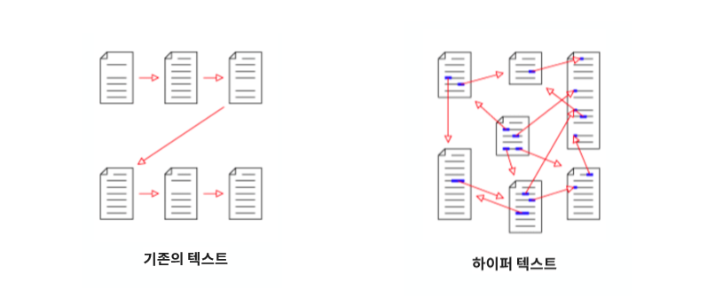
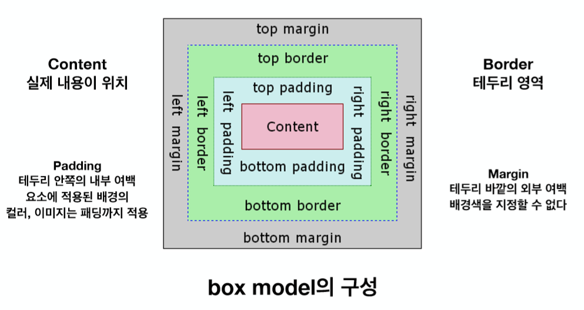

# HTML&CSS_INTRO

### WWW

 : **World Wide Web(월드 와이드 웹, W3)**

인터넷에 연결된 컴퓨터들을 통해 사람들이 정보를 공유할 수 있는 전 세계적인 정보 공간

간단히 웹(Web)이라 부르는 경우가 많다. 인터넷과 동의어로 쓰이는 경우가 많으나 엄격히 말하면 서로 다른 개념이다.

<br>

요청(request) / 응답(response)

요청의 종류

1. GET - 받다(줘라)
2. POST - 보내다(받아라)

<br>

**IP(Internet Protocol)**

 : 8bit(0~255)까지의 숫자로 구성된 숫자의 집합. 각자가 가지고 있는 주소와 동일

**Domain(도메인)**

 : 네트워크상의 컴퓨터를 식별하는 호스트명

**URL(Uniform Resource Locator)**

 : 도메인 + 경로, 실제로 해당 서버에 저장된 자료의 위치

<br>

Static web

Dynamic Web Web Application program(Web App)

<br>

W3C - 웹 표준

**HTML**

 : Hyper Text Markup Language

Hyper Text란 기존의 선형적인 텍스트가 아닌 비선형적으로 이루어진 텍스트를 의미.



**HTTP**

 : Hyper Text Transfer Protocol(Hyper Text를 주고받는 규칙)

<br>

```html
<!-- 사용하는 문서의 종류를 선언하는 부분. 보통 html을 사용 -->
<!DOCTYPE html>

<!-- 
html요소
HTML문서의 최상위 요소로 문서의 root를 의미
head와 body부분으로 구분됨
-->
<html lang="ko">
    
<!--
head요소
문서, 제목, 문자코드(인코딩)와 같은 해당 문서 정보를 담고 있으며,
브라우저에 나타나진 않는다.

CSS선언 혹은 외부 로딩 파일 지정 등을 작성
-->
<head>
    <meta charset="UTF-8">
    <title>Document</title>
</head>
    
<!-- 
body요소
브라우저 화면에 나타나는 정보로 실제 내용에 해당
-->
<body>
    
</body>
</html>
```


<br>

```html
<태그명 속성1 = "속성값" 속성2="속성값"> 내용 </태그명>

<!-- Self-closing element -->

```

<br>

**시맨틱태그**

 : 컨텐츠의 의미를 설명하는 태그

- header
- nav
- aside
- section
- article
- footer

<br>

**non-semantic element**

- div
- span
- ...

<br>

list bullet 모양 바꾸기

```html
<li style="list-style-type:circle">HTML</li>
```

`none, square, circle, lower-alpha, upper-alpha, upper-roman`

<br><br>

**CSS**

 : Cascading Style Sheet

`Selector { Property:Value; }`

```css
h1 {
    color:blue;
    font-size:15px;
}
```

<br>

### HTML&CSS 연결

1. 요소의 style에 css넣기

2. 내부에 css 포함시키기

3. 외부에 css파일 로드하기

   ```html
   <link rel="stylesheet" href="경로">
   ```

<br>

**크기 단위**

- px
- %
- em : 배수 단위로 상대 단위
- rem : 최상위의 요소(html)의 사이즈를 기준으로 삼음
- Viewport

<br>

**Padding&Margin**



<br>

### **display**

1. **block**

   항상 새로운 라인에서 시작<br>

   ex) div, h1~h6, p, ol, ul, li, hr, table, form

2. **inline**

   새로운 라인에서 시작하지 않으며 문장의 중간에 들어갈 수 있다.<br>

   content의 너비만큼 가로폭을 차지<br>

   width, height, margin-top, margin-bottom 프로퍼티를 지정할 수 없다.<br>

   상, 하, 여백은 line-height로 지정한다.<br>

   ex) span, a, strong, img, br, input, select, textarea, button

3. **inline-block**

   inline레벨 요소처럼 한 줄에 표시되며, block과 inline 레벨 요소의 특징을 모두 갖음<br>

   block의 width, height, margin(top, bottom) 속성 모두 지정 가능

4. **none**

   해당 요소를 화면에 표시하지 않는다.(공간조차 사라짐)

<br>

### Visibility

1. **visible**

    : 해당 요소를 보이게 한다.(기본값)

2. **hidden**

   : 해당 요소를 안보이게 한다.(공간조차 사라진다)

<br>

### Element Position

1. **static**

   : 기본적인 요소의 배치 순서에 따라 위에서 아래로, 왼쪽에서 오른쪽으로 순서에 따라 배치되며 부모 요소 내에 자식 요소로서 존재할 때는 부모 요소의 위치를 기준으로 배치된다.

2. **relative**

   : 기본 위치(static으로 지정되었을 때의 위치)를 기준으로 좌표 프로퍼티(top, bottom, left, right)를 사용하여 위치를 이동

3. **absolute**

   : 부모 요소 또는 가장 가까이 있는 조상 요소(static 제외)를 기준으로 좌표 프로퍼티만큼 이동한다. 즉, relative, absolute, fixed 프로퍼티가 선언되어 있는 부모 또는 조상 요소를 기준으로 위치가 결정.

4. **fixed**

   : 부모 요소와 관계없이 브라우저의 viewport를 기준으로 좌표프로퍼티를 사용하여 위치를 이동시킨다. 스크롤이 되더라도 화면에서 사라지지 않고 항상 같은 곳에 위치한다.