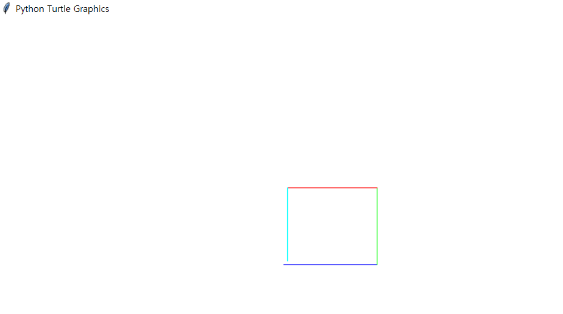

# Turtle Graphics:turtle:

`터틀 그래픽`

### reset command

- reset()

  : 화면을 지우고 화살표(거북이)를 가운데로 놓는다. 모든 변수 값은 초기화

- clear()

  : 화면을 지움

<br>

### write command

- forward(distance)

  : 앞으로 나아가기

- backward(distance)

  : 뒤로 나아가기

- left(angle)

  : 왼쪽으로 회전

- right(angle)

  : 오른쪽으로 회전

- goto(x, y)

  : 특정 위치로 펜이 이동

- circle(radius[, extent])

  : 원을 그린다. radius - 반지름, extend - 그릴 분량의 각 범위(180, -180)

- write(text[, move])

  : 텍스트를 씀. move가 1이면 펜이 이동

<br>

### setting command

- degrees()

  : 각도 단위를 각도(Degree)로 설정

- radians()

  : 각도 단위를 라디안(Radian)으로 설정

- tracer(flag)

  : tracer(True)로 설정하면(기본값) 선이 천천히 그려지는 것이 보이고(거북이가 이동하는 것처럼), tracer(False)로 설정하면 최대한 빠르게 그려짐

- up()

  : 앞으로 나아가거나 뒤로 나아갈 때 그림이 그려지지 않음

- down()

  : 앞으로 나아가거나 뒤로 나아갈 때 그림이 그려짐. 기본값

- width(width)

  : 선의 폭을 설정

- color(r,g,b)

  : 선의 색 설정. 각각의 값은 0 또는 1

- fill(flag)

  : 0 - 도형을 채우지 않음, 1 - 도형 채우기

<br>

### ETC command

- demo()

  : 데모를 보여줌

<br>

ex1)



```python
import turtle

turtle.tracer(False)
t1 = turtle.Turtle() #turtle object 1개를 생성

screen = t1.getscreen() #스크린 객체를 얻기
w = 150
screen.setworldcoordinates(-w, -w, w, w) #스크린 좌표 영역을 설정

for i in range(4):
    if i == 0:
        t1.color(0,0,1) #B
    elif i == 1:
        t1.color(0,1,0) #G
    elif i == 2:
        t1.color(1,0,0) #R
    else:
        t1.color(0,1,1) #G+B
    t1.forward(50-i)
    t1.left(90)
    
turtle.tracer(True)
t1.hideturtle() #
turtle.done()
```

<br>


```python
import turtle

turtle.tracer(False)
t1 = turtle.Turtle() #turtle object 1개를 생성

screen = t1.getscreen() #스크린 객체를 얻기
w = 150
screen.setworldcoordinates(-w, -w, w, w) #스크린 좌표 영역을 설정
for i in range(200):
    t1.forward(i)
    t1.left(90.5)
turtle.tracer(True)
t1.hideturtle() #거북이를 숨김
turtle.done()
```

