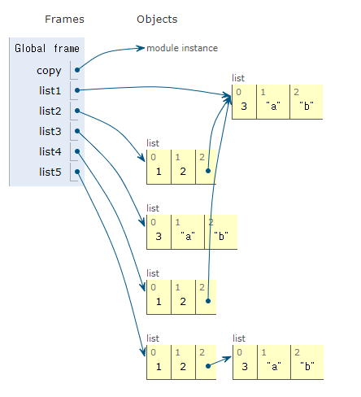

### :one:

### 얇은 복사와 깊은 복사

```python
import copy

list1 = [3, 'a', 'b']
list2 = [1, 2, list1]

list3 = list1[:]
list4 = copy.copy(list2)
list5 = copy.deepcopy(list2)
```

**깊은 복사(deepcopy)** - 값을 복사

**얇은 복사(copy)** - 값의 주소값을 복사

<br>

복사를 진행할 때 내부의 리스트에서는 복사가 어떻게 이뤄지는지  `copy`와 `deepcopy` 파악필요

```python
print(list1 == list3) #True

list4[2][0] = 4
print(list2[2][0])

list4[2] = 5
print(list2[2])
```

<br>




<br>

### :two:

### 전역변수와 지역변수

```python
a = 1
def my_func_1():
    a = 5
    my_func_2()
    
def my_func_2():
    print(a, end="")

my_func_1()
print(a)
```

<br>

```python
name = 'hong'
class Person:
    name = 'choi'
    def greeting(self):
        print(name)

person = Person()
person.name = "kim"
person.greeting() #hong
```

`self`를 사용하였느냐 안하였느냐를 확인할 것

<br>

### :three:

### Dictionary

dictionary 비교

```python
d1 = {"d":dict()}
d2 = dict(d={})

print(d1==d2)
print(len(d1),len(d2))
print(d1.keys(), d2.keys())
print(d1.values(), d2.values())
print(type(d1))
print(id(d1)==id(d2))

"""
[결과값]
True
1 1
dict_keys(['d']) dict_keys(['d'])
dict_values([{}]) dict_values([{}])
<class 'dict'>
False
"""
```

