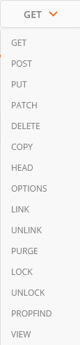

### :one:

### API 서비스

REST방식

- RESTful이라고도 지칭됨
- **자원(Resource)** : URI
- **행위(Verb)** : HTTP METHOD - `GET/POST`
- **표현(Representations)**

`requests get add headers` - ex) 네이버 개발자 GET API

 

SOAP방식

 

**파싱 데이터 보기 편한 방법**

Postman

https://chrome.google.com/webstore/detail/postman/fhbjgbiflinjbdggehcddcbncdddomop?hl=ko

  

### :two:

### 파이썬과 DB연동

`$ flask db init`

`$ flask db migrate`

`$ flask db upgrade`

