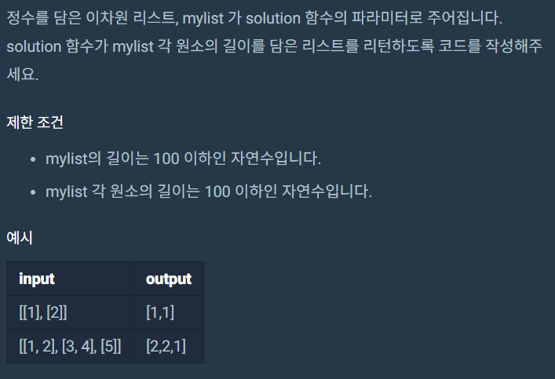

# 파이썬을 파이썬답게 Intro

​	프로그래머스에 있는 강의 [파이썬을 파이썬답게](https://programmers.co.kr/learn/courses/4008)를 정리한 내용입니다.


## Intro 문제

아래의 문제를 풀어주세요.



```python
#제시코드
def solution(mylist):
    answer = mylist[0]
    return answer
```


## 풀이 답안

```python
#제출 답안 코드
def solution(mylist):
    answer = list(map(len, mylist))
    return answer
```

map은 `int`와 `str`로만 나눌 수 있는 것이 아니다.


## 개념 체크

### iterable

: 자신의 멤버를 한 번에 하나씩 리턴할 수 있는 객체

>  list, str, tuple, dict 등이 여기에 속한다


### sequence

: int 타입 인덱스를 통해, 원소에 접근할 수 있는 iterable

>  iterable의 하위 카테고리라고 생각하면 된다
>
> list, str, tuple이 여기 속한다

