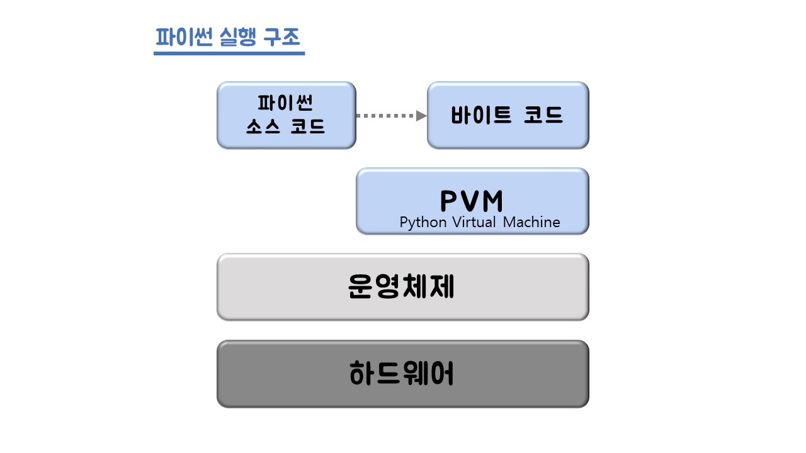

# 레퍼런스 카운트와 가비지 컬렉션

파이썬 자동으로 메모리 소멸

그러면 언제 소멸 되는가?

> **레퍼런스 카운트**
>
> 내가 선언한 메모리가 언제 소멸하는지

파이썬에서는 모든 것이 객체이다.


## 레퍼런스 카운트

: 객체를 참조하는 변수의 수


## 가비지 컬렉션

```python
data = [1,2,3,4,5] # 변수명 data가 [1,2,3,4,5] 리스트를 참조(레퍼런스)한다.
```

**생성된 [1,2,3,4,5]는 언제 소멸하는가?**

> 객체를 아무도 참조하지 않는 상황에 소멸한다.
>
> 현재 data의 rc(reference counting)가 1이다.


```python
data = [1,2,3,4,5]
data = 'test' # 변수명 data가 'test' 문자열을 참조(레퍼런스)한다.
```

위와 같은 경우는 data가 [1,2,3,4,5] 리스트를 참조하였다가 'test' 문자열을 참조한다. 

rc를 보게 되면, [1,2,3,4,5]의 rc는 1이었다가 data가 test를 받는 순간 0이 된다.

이렇게 됐을 때, [1,2,3,4,5]는 아무것도 참조받지 않으며, 소멸 대상이 된다.

(단, 소멸 대상이 되었다고 바로 소멸되는 것은 아니다.)


**그렇다면 rc가 1을 유지할 때는 메모리가 지속적으로 유지되는가?**

고민하는게 이상할 정도로 답은 당연하다. 프로그램이 끝날 때 소멸될 것이다.





### 참고자료
https://winterj.me/python-gc/#2-%EA%B0%80%EB%B9%84%EC%A7%80-%EC%BB%AC%EB%A0%89%EC%85%98%EC%9D%98-%EC%9E%91%EB%8F%99-%EB%B0%A9%EC%8B%9D