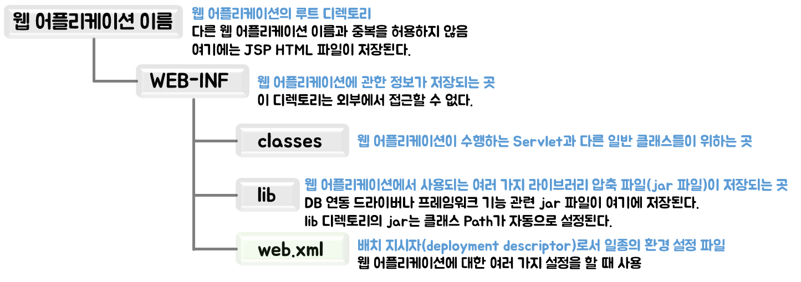

# Hello, Spring

웹 어플리케이션 서버(WAS, Web Application Server)

처음에 동적인 방식으로 프로그램을 제공하는 기능은 CGI(Common Gate Interface, 공용 게이트웨이 인터페이스)였다. 프로그래밍 언어인 펄(Perl)이 대표적인 CGI 언어다.

## CGI 동작방식

- 프로세스(Process) 방식으로 실행됨
- 서버의 부하가 심함

### CGI 동작 방식 문제점

- CGI 방식은 같은 기능을 수행하더라도 각 경우에 대해서 처음부터 메모리에 로드해서 수행해야 함
- 초기 인터넷 환경에선 사용자 수와 수행할 기능이 적으므로 실행 문제를 발생시키지 않음
- 사용자 수가 급격히 늘고 기능이 복잡해지면서 이런 방식으로 서비스 수행 시 메모리에 과부하가 걸리는 문제를 발생시킴
- 이런 문제를 해결하면서 나온 기술들이 JSP, ASP, PHP

## JSP 프로그램의 특징

브라우저 요청시 스레드(thread)방식으로 실행하므로 CGI보다 효율적으로 기능을 수행함

### JSP 동작 방식의 특징

- 프로세스 방식이 아닌 스레드 방식으로 실행
- 클라이언트 요구를 처리하는 기능은 최초 한번만 메모리에 로드됨
- 클라이언트가 동일한 기능을 요구하면 기존에 사용한 기능을 재사용함
- 따라서 프로세스 방식으로 동작하는 것보다 훨씬 빠르게 수행할 수 있음

## 개발 환경 설정하기

### 1. JDK 설치하기

Oracle 사이트에 아이디가 있어야 사용 가능

https://www.oracle.com/java/technologies/downloads/#java8-windows

### 2. 환경변수 설정

`JAVA_HOME` jdk경로 (ex. C:\Program Files\Java\jdk1.8.0_321)

path에서 새로 추가하여 `%JAVA_HOME%\bin`을 추가

cmd에서 `javac -version`을 쳤을 때 javac 해당 버전이 나오면 된다.

### 3. Apache Tomcat 설치

:warning:Tomcat 버전마다 Java 버전에 대한 최소한 조건이 있다.

https://tomcat.apache.org/download-10.cgi#10.0.21

### 4. ECLIPSE 설치

STS도 아니고 Eclipse라니...

https://www.eclipse.org/downloads/

`Eclipse IDE for Enterprise Java and Web Developers`

**Java Documentation**

https://javaee.github.io/javaee-spec/javadocs/

## 웹 어플리케이션

기존의 정적 웹 어플리케이션 기능을 그대로 사용하면서 Servlet, JSP, Java Class들을 추가하여 사용자들에게 동적인 서비스를 제공하는 프로그램

### 웹 어플리케이션 기본 구조

톰캣 같은 컨테이너에서 실행되는 웹 어플리케이션은 일정한 디렉토리 구조를 갖추어야 한다.

| 구성 요소    | 기능                            |
| -------- | ----------------------------- |
| jsp/html | JSP 파일과 HTML 파일이 저장된 곳        |
| css      | 스타일시트 파일이 저장된 곳               |
| image    | 웹 어플리케이션에서 사용되는 이미지가 저장된 곳    |
| js       | 자바스크립트 파일이 저장된 곳              |
| bin      | 어플리케이션에서 사용되는 각종 실행 파일이 저장된 곳 |
| conf     | 프레임워크에서 사용하는 각종 설정 파일이 저장된 곳  |
| src      | 자바 소스 파일이 저장된 곳               |

