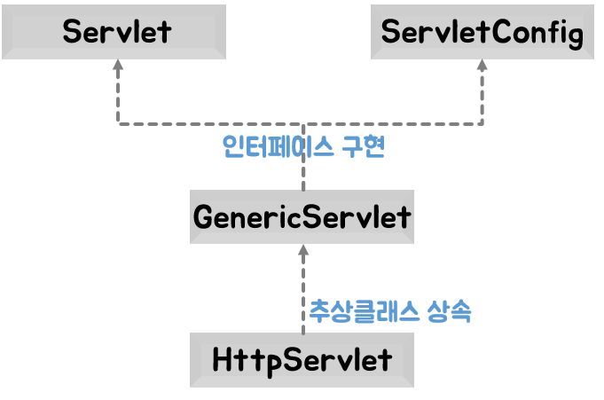
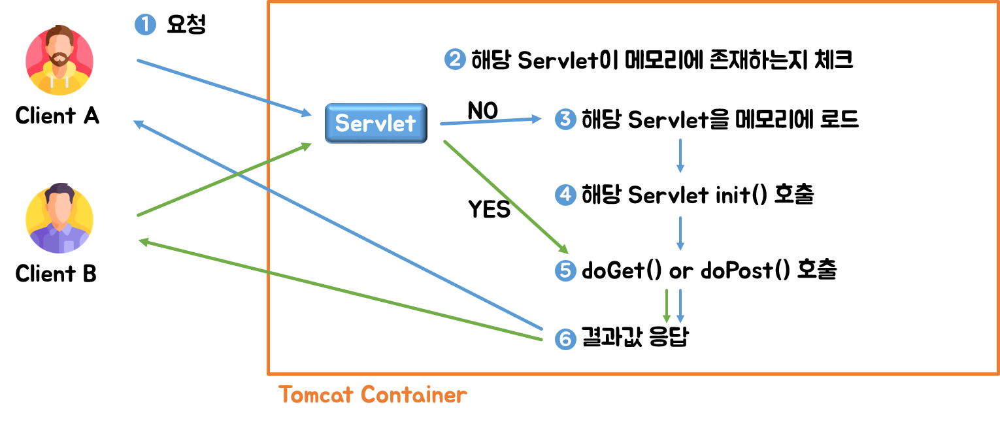

# Servlet

서버쪽에서 실행되면서 클라이언트의 요청에 따라 동적으로 서비스를 제공하는 자바 클래스


## Servlet이란

### 특징

- 서버쪽에서 실행되면서 기능을 수행
- 기존의 정적인 웹 프로그램의 문제점을 보완하여 동적인 여러 가지 기능을 제공
- Thread 방식으로 실행됨
- 자바로 만들어져 자바의 특징(객체 지향)을 가짐
- 컨테이너에서 실행됨
- 컨테이너 종류에 상관없이 실행됨(플랫폼 독립적)
- 보안 기능을 적용하기 쉬움
- 웹 브라우저에서 요청시 기능을 수행함


### Servlet API 계층 구조와 기능



// TODO: 해당 내용들 소스로 확인 필요


| Servlet 구성요소          | 기능                                                         |
| ------------------------- | ------------------------------------------------------------ |
| Servlet (interface)       | - javax.servlet 패키지에 선언<br />- Servlet 관련 추상 메서드를 선언<br />- init(), service(), destroy(), getServletInfo(), getServletConfig()를 선언되어 있음 |
| ServletConfig (interface) | - javax.servlet 패키지에 선언<br />- Servlet 기능 관련 추상 메서드가 선언<br />- getInitParamter(), getInitParameterNames(), getServletContext(), getServletName()이 선언되어 있음 |
| GenericServlet (class)    | - javax.servlet 패키지에 선언<br />- 상위 두 인터페이스를 구현하여 일반적인 Servlet 기능을 구현한 클래스<br />- GenericServlet을 상속받아 구현한 사용자 Servlet은 사용되는 프로토콜에 따라 각각 service()를 오버라이딩해서 구현 |
| HttpServlet (class)       | - javax.servlet.http 패키지에 선언<br />- GenericServlet을 상속받아 HTTP 프로토콜을 사용하는 웹 브라우저에서 Servlet 기능을 수행<br />- 웹 브라우저 기반 서비스를 제공하는 Servlet을 만들 때 상속받아 사용<br />- 요청시 service()가 호출되면서 요청 방식에 따라 doGet(), doPost()가 차례대로 호출됨 |

- GenericServlet 클래스는 여러 통신 프로토콜에 대한 Servlet 기능을 구현함
- GenericServlet 클래스를 상속받는 HttpServlet 클래스는 HTTP 프로토콜을 사용하는 Servlet 기능을 수행함


#### HttpServlet 클래스의 여러 가지 메서드 기능

| Method                                                       | 기능                                                         |
| ------------------------------------------------------------ | ------------------------------------------------------------ |
| protected doDelete(HttpServletRequest req, HttpServletResponse resp) | Servlet DELETE request를 수행하기 위해 service()를 통해서 호출됨 |
| protected doGet(HttpServletRequest req, HttpServletResponse resp) | Servlet GET request를 수행하기 위해 service()를 통해서 호출됨 |
| protected doHead(HttpServletRequest req, HttpServletResponse resp) | Servlet HEAD request를 수행하기 위해 service()를 통해서 호출됨 |
| protected doPost(HttpServletRequest req, HttpServletResponse resp) | Servlet POST request를 수행하기 위해 service()를 통해서 호출됨 |
| protected service(HttpServletRequest req, HttpServletResponse resp) | 표준 HTTP request를 public service()에서 전달받아 doXXX() 메서드를 호출함 |
| public service(HttpServletRequest req, HttpServletResponse resp) | Client의 request를 protected service()에게 전달함            |

> **Clinet 요청 -> public service() 호출 -> protected service() 호출 -> doXXX() 호출**


### Servlet Life Cycle Method

Servlet 실행 단계마다 호출되어 기능을 수행하는 Callback method

**Servlet 생명 주기 메서드 기능**

| 생명 주기 단계 | 호출 메서드           | 기능                                                         |
| -------------- | --------------------- | ------------------------------------------------------------ |
| 초기화         | init()                | - Servlet 요청 시 맨 처음 한 번만 호출됨<br />- Servlet 생성 시 초기화 작업을 주로 수행함 |
| 작업 수행      | doGet()<br />doPost() | - Servlet 요청 시 매번 호출됨<br />- 실제로 클라이언트가 요청하는 작업을 수행함 |
| 종료           | destroy()             | - Servlet이 기능을 수행하고 메모리에서 소멸될 때 호출됨<br />- Servlet의 마무리 작업을 주로 수행함 |

:pencil2:init()와 destroy() Method는 생략 가능하나 doXXX() Method는 반드시 구현해야함


### Servlet 생성 과정

1. 사용자 정의 Servlet class 만들기
2. Servlet 생명주기 메서드 구현
3. Servlet 매핑 작업
4. 웹 브라우저에서 Servlet 매핑 이름으로 요청하기

```java
package exam;

import java.io.IOException;

import jakarta.servlet.ServletException;
import jakarta.servlet.http.HttpServlet;
import jakarta.servlet.http.HttpServletRequest;
import jakarta.servlet.http.HttpServletResponse;

public class HelloServlet extends HttpServlet {
	@Override
	public void init() throws ServletException {
		System.out.println("init Method Call!");
	}
	
	@Override
	protected void doGet(HttpServletRequest req, HttpServletResponse resp) throws ServletException, IOException {
		System.out.println("doGet Method Call!");
	}
	
	@Override
	public void destroy() {
		System.out.println("Destroy Method Call!");
	}

}
```

#### Tomcat의 `servlet-api.jar` class path 설정하기

- Servlet API는 tomcat의 servlet-api.jar 라이브러리로 제공되므로 class path를 설정해야 사용할 수 있다.

:warning:해당 부분을 추가하지 않으면 라이브러리를 import하지 못함


#### Servlet 매핑하기

`http://주소:port/프로젝트명/패키지명이 포함된 클래스명`

- 클래스 이름이 길어지면 불편하며 보안에도 좋지 않음

-> Servlet Mapping 이름으로 요청하기


- 각 프로젝트에 있는 web.xml에서 설정
- `<servlet>` 태그와 `<servlet-mapping>` 태그를 이용
- 여러 개의 servlet 매핑 시에는 `<servlet>` 태그를 먼저 정의하고 `<servlet-mapping>` 태그를 정의함

```xml
<?xml version="1.0" encoding="UTF-8"?>
<web-app
xmlns:xsi="http://www.w3.org/2001/XMLSchema-instance"
xmlns="http://xmlns.jcp.org/xml/ns/javaee"
xsi:schemaLocation="http://xmlns.jcp.org/xml/ns/javaee http://xmlns.jcp.org/xml/ns/javaee/web-app_4_0.xsd"
id="WebApp_ID"
version="4.0">

  <servlet>
  	<servlet-name>hello</servlet-name>
  	<servlet-class>exam.HelloServlet</servlet-class>
  </servlet>
  
  <servlet-mapping>
  	<servlet-name>hello</servlet-name>
  	<url-pattern>/first</url-pattern>
  </servlet-mapping>
    
</web-app>
```

`<servlet-name>`: servlet 태그와 servlet-mapping 태그를 연결 시켜주는 역할

`<url-pattern>`: 웹 브라우저에서 요청하는 매핑 이름 :warning:해당 부분에 `/`를 넣지 않아서 tomcat오류로 문제가 있었음

`http://주소:port/프로젝트명/Servlet매핑명`


### 다수의 서블릿 매핑하기

- 일반적인 웹 어플리케이션은 각 기능에 대한 Servlet을 따로 만들어서 서비스를 제공함

```xml
<?xml version="1.0" encoding="UTF-8"?>
<web-app
xmlns:xsi="http://www.w3.org/2001/XMLSchema-instance"
xmlns="http://xmlns.jcp.org/xml/ns/javaee"
xsi:schemaLocation="http://xmlns.jcp.org/xml/ns/javaee http://xmlns.jcp.org/xml/ns/javaee/web-app_4_0.xsd"
id="WebApp_ID"
version="4.0">

  <servlet>
  	<servlet-name>hello</servlet-name>
  	<servlet-class>exam.HelloServlet</servlet-class>
  </servlet>
  <servlet>
  	<servlet-name>second</servlet-name>
  	<servlet-class>exam.SecondServlet</servlet-class>
  </servlet>
  
  <servlet-mapping>
  	<servlet-name>hello</servlet-name>
  	<url-pattern>/first</url-pattern>
  </servlet-mapping>
  <servlet-mapping>
  	<servlet-name>second</servlet-name>
  	<url-pattern>/second</url-pattern>
  </servlet-mapping>
</web-app>
```

추가될 때마다 하나씩 연결했던 부분과 동일하게 만들어주면 됨.


**Servlet 동작 과정**




## Annotation을 이용한 Servlet Mapping

- web.xml에 여러 Servlet 매핑 설정시 복잡해짐
- Servlet 클래스에 직접 Annotation으로 설정하면 가독성이 좋아짐
- @WebServlet을 이용해서 Servlet 매핑을 구현함

```java
@WebServlet("/test")
public class ServletTest extends HttpServlet {
    // ...
}
```

:warning:**Annotation을 이용해서 만드는 Servlet class는 반드시 HttpServlet을 상속 받아야 한다.**


```java
package exam;

import jakarta.servlet.http.HttpServlet;
import java.io.IOException;
import jakarta.servlet.ServletException;
import jakarta.servlet.annotation.WebServlet;
import jakarta.servlet.http.HttpServletRequest;
import jakarta.servlet.http.HttpServletResponse;

/**
 * Servlet implementation class AnnotationServlet
 */
@WebServlet("/anno")
public class AnnotationServlet extends HttpServlet {
	// Servlet class 직렬화를 위해 이클립스에서 자동으로 지정한 상수
	private static final long serialVersionUID = 1L;
       
    /**
     * @see HttpServlet#HttpServlet()
     */
    public AnnotationServlet() {
        super();
        // TODO Auto-generated constructor stub
    }

	/**
	 * @see HttpServlet#doGet(HttpServletRequest request, HttpServletResponse response)
	 */
	protected void doGet(HttpServletRequest request, HttpServletResponse response) throws ServletException, IOException {
		// TODO Auto-generated method stub
		response.getWriter().append("Served at: ").append(request.getContextPath());
	}

	@Override
	public void destroy() {
		// TODO Auto-generated method stub
		System.out.println("Annotation Servlet Destroy!");
	}

	@Override
	public void init() throws jakarta.servlet.ServletException {
		// TODO Auto-generated method stub
		System.out.println("Annotation Servlet Init!");
	}

	/**
	 * @see HttpServlet#doPost(HttpServletRequest request, HttpServletResponse response)
	 */
	protected void doPost(HttpServletRequest request, HttpServletResponse response) throws ServletException, IOException {
		// TODO Auto-generated method stub
		doGet(request, response);
	}

}
```

Class 형태로 만들어서 내용을 구성한 것이 아닌, Servlet으로 바로 만들었는데 조금의 문제가 있다.

버전이 높아서 그런지 import에서 `jakarta.servlet`으로 사용하고 있는데 만들어진 부분은 구버전에 맞춰서 나오는거라 그런지 javax로 되어 있어서 import부분에서 오류가 발생하여 수정하였다.

> **tomcat 버전에 따라 servlet-api.jar 부분에서 차이가 있는 것으로 보임**

:warning:기존의 mapping 이름과 중복이 되면 오류가 발생한다. 그러니 중복되지 않도록 주의!


