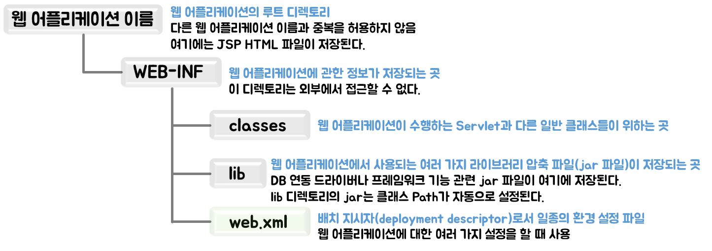

# Hello, Spring

웹 어플리케이션 서버(WAS, Web Application Server)

처음에 동적인 방식으로 프로그램을 제공하는 기능은 CGI(Common Gate Interface, 공용 게이트웨이 인터페이스)였다. 프로그래밍 언어인 펄(Perl)이 대표적인 CGI 언어다.


## CGI 동작방식

- 프로세스(Process) 방식으로 실행됨
- 서버의 부하가 심함

### CGI 동작 방식 문제점

- CGI 방식은 같은 기능을 수행하더라도 각 경우에 대해서 처음부터 메모리에 로드해서 수행해야 함
- 초기 인터넷 환경에선 사용자 수와 수행할 기능이 적으므로 실행 문제를 발생시키지 않음
- 사용자 수가 급격히 늘고 기능이 복잡해지면서 이런 방식으로 서비스 수행 시 메모리에 과부하가 걸리는 문제를 발생시킴
- 이런 문제를 해결하면서 나온 기술들이 JSP, ASP, PHP


## JSP 프로그램의 특징

브라우저 요청시 스레드(thread)방식으로 실행하므로 CGI보다 효율적으로 기능을 수행함

### JSP 동작 방식의 특징

- 프로세스 방식이 아닌 스레드 방식으로 실행
- 클라이언트 요구를 처리하는 기능은 최초 한번만 메모리에 로드됨
- 클라이언트가 동일한 기능을 요구하면 기존에 사용한 기능을 재사용함
- 따라서 프로세스 방식으로 동작하는 것보다 훨씬 빠르게 수행할 수 있음


## 개발 환경 설정하기

### 1. JDK 설치하기

Oracle 사이트에 아이디가 있어야 사용 가능

https://www.oracle.com/java/technologies/downloads/#java8-windows


### 2. 환경변수 설정

`JAVA_HOME` jdk경로 (ex. C:\Program Files\Java\jdk1.8.0_321)

path에서 새로 추가하여 `%JAVA_HOME%\bin`을 추가


cmd에서 `javac -version`을 쳤을 때 javac 해당 버전이 나오면 된다.


### 3. Apache Tomcat 설치

:warning:Tomcat 버전마다 Java 버전에 대한 최소한 조건이 있다.

https://tomcat.apache.org/download-10.cgi#10.0.21


### 4. ECLIPSE 설치

STS도 아니고 Eclipse라니...

https://www.eclipse.org/downloads/


`Eclipse IDE for Enterprise Java and Web Developers`


**Java Documentation**

https://javaee.github.io/javaee-spec/javadocs/


## 웹 어플리케이션

기존의 정적 웹 어플리케이션 기능을 그대로 사용하면서 Servlet, JSP, Java Class들을 추가하여 사용자들에게 동적인 서비스를 제공하는 프로그램

### 웹 어플리케이션 기본 구조

톰캣 같은 컨테이너에서 실행되는 웹 어플리케이션은 일정한 디렉토리 구조를 갖추어야 한다.



| 구성 요소    | 기능                            |
| -------- | ----------------------------- |
| jsp/html | JSP 파일과 HTML 파일이 저장된 곳        |
| css      | 스타일시트 파일이 저장된 곳               |
| image    | 웹 어플리케이션에서 사용되는 이미지가 저장된 곳    |
| js       | 자바스크립트 파일이 저장된 곳              |
| bin      | 어플리케이션에서 사용되는 각종 실행 파일이 저장된 곳 |
| conf     | 프레임워크에서 사용하는 각종 설정 파일이 저장된 곳  |
| src      | 자바 소스 파일이 저장된 곳               |


### Tomcat 컨테이너에서 웹 어플리케이션 실행하기

- 웹 어플리케이션은 일반 PC에서 실행되는 자바 어플리케이션과 달리 단독으로 실행할 수 없다.
- 웹 어플리케이션은 톰캣과 같은 웹 컨테이너에서 실행되는 구조이다.
- 웹 어플리케이션을 샐행하려면 우선 톰캣에 등록부터 해야한다.


#### 등록 방법

1. `%CATALINA_HOME%webApp` 디렉토리에 어플리케이션을 저장
2. `server.xml`에 직접 웹 어플리케이션을 등록


:notebook:JDK 경로를 환경 변수에 등록하면서 JDK 루트 디렉토리를 `JAVA_HOME`이라고 했다. 톰캣의 루트 디렉토리는 보통 `CATALINA_HOME`으로 묵시적으로 사용하고 있다.


레지스트리 편집기 -> HKEY_CURRENT_USER -> Console -> C:_tomcat...exe -> CodePage -> 단위: 10진수 / 값 데이터: 65001

프로젝트를 복사해서 `tomcat/webapps` 복사해 넣으면 된다.

이후에 tomcat.exe를 실행하여 `localhost:port/프로젝트명/파일명.html`주소를 치면 나오게 된다.


### 컨테이너에서 웹 어플리케이션 실행하기

#### context란

- 톰캣의 server.xml에 등록하는 웹 어플리케이션을 Context라 합니다.
- 즉, 톰캣 입장에서 인식하는 한 개의 웹 어플리케이션

#### context의 특징

- 웹 어플리케이션당 하나의 context가 등록됨
- 웹 어플리케이션 이름과 같을 수도 있고 다를 수도 있음
- context 이름은 중복되면 안됨
- 웹 어플리케이션의 의미를 가장 잘 나타낼 수 있는 명사형으로 지정
- 대소문자 구분
- server.xml에 등록

#### `<context> `태그란

- 톰캣은 모든 설정 정보를 XML로 저장한 후 실행 시 정보를 읽어와 설정대로 실행함
- 만든 웹 어플리케이션도 미리 `<Context>`태그를 이용해서 server.xml에 등록해 두어야 톰캣이 설정한 대로 웹 어플리케이션을 실행함


#### `<Context>` 태그 구성요소의 기능

| 구성요소   | 기능                                                         |
| ---------- | ------------------------------------------------------------ |
| path       | 웹 어플리케이션의 Context 이름.<br />웹 어플리케이션 이름과 다를 수도 있으며, 웹 브라우저에서 실제 웹 어플리케이션을 요청하는 이름 |
| docBase    | Context에 대한 실제 웹 어플리케이션이 위치한 경로<br />WEB-INF 상위 폴더까지의 경로를 나타냄 |
| reloadable | 실행 중 소스 코드가 수정될 경우 바로 갱신할지를 설정<br />만약 false로 설정하면 톰캣을 다시 실행해야 추가한 소스 코드의 기능이 반영됨 |

```xml
<Context path="/컨텍스트 이름"
         docBase="실제 웹 어플리케이션의 WEB-INF 디렉토리 위치"
         reloadable="true 또는 false" />
```

사용 예시)

```xml
<Context path="/web"
         docBase="C:\\webShop"
         reloadable="true" />
```

위와 같이 설정시 주소 -> `http://localhost:port/web/main.html`


### 이클립스 실습

`File -> New -> Dynamic Web Project`

Project name =  webApplication의 이름

`Generate web.xml deployment descriptor` :heavy_check_mark:


WebContent 아래에 `main.html`생성

`Servers -> new -> Server -> Apache -> Tomcat 설치한 version ->  Tomcat설치한 경로 설정 -> 사용할 resource 설정`


## 웹 어플리케이션 배치하기

### 배치(Deploy)란?

개발이 완료된 웹 어플리케이션을 실제 사용자들에게 서비스하기 위한 작업

#### 톰캣에 배치하기

`File -> Export... -> Web -> WAR file -> 위치(톰캣/webapps)`

톰캣을 다시 실행하면 해당 프로젝트.war가 풀려서 프로젝트 폴더가 생기게 됩니다.


#### HTML 생성시 UTF-8 설정

`Window -> Preferences -> Web -> HTML Files -> Encoding -> ISO 10646/Unicode(UTF-8)`

JSP Files도 동일하게 설정


---

Deploy 배포 부분은 추후에 프로젝트가 완성되고 할 부분이기에 참고만 하고 해당 부분을 기반으로 배포하는 것도 해보자.